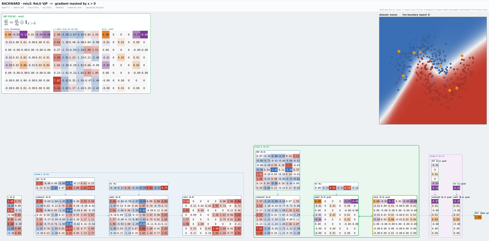

# micrograd

This project is a personal learning project which purpose is to reimplement core deep learning principles in
numpy and build intuition on those. It is heavily inspired and built on top of Andrej Karpathy's `micrograd` project.

It currently implements a working MLP trainable on classification tasks using the Adam optimizer.

The `visualisation` module is a vibe-coded mess, the code is horrendous but the result looks nice :p

Forked from https://github.com/karpathy/micrograd.

### Installation

```bash
uv sync --all-extras
```

### Examples

You can run toy classification problems (scikit learn moons and circles) by running:
```
python examples/toy_classification.py  --dataset moons

```

and 
```

python examples/toy_classification.py  --dataset circles
```


### Visualisation
The visualisation module allows to see _everything_ happening in the network during training, including
forward and backward passes.



### License


MIT
