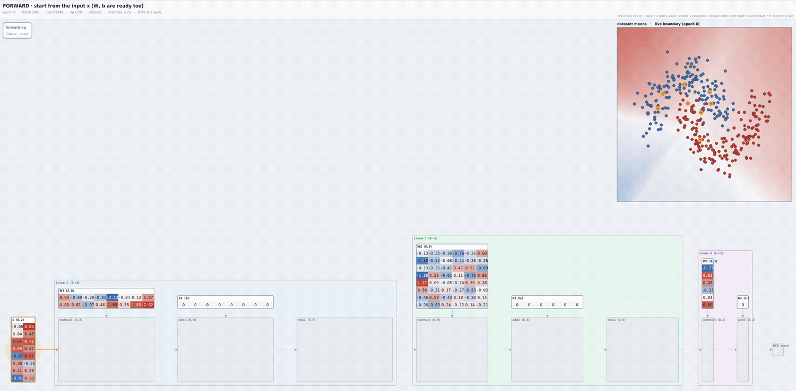
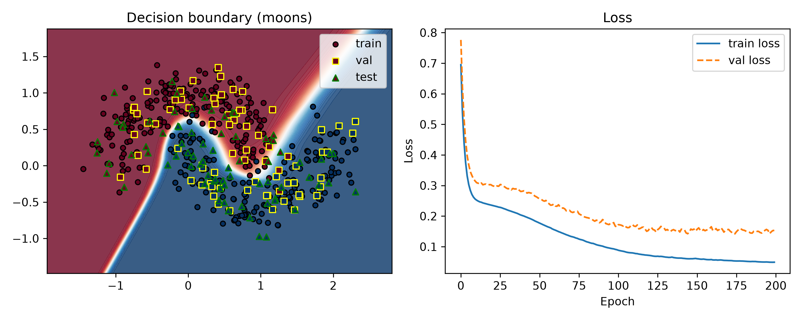
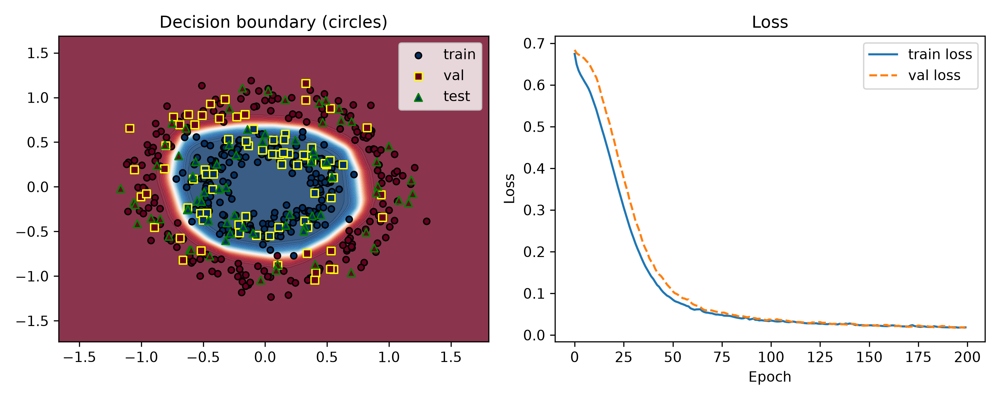

# micrograd

This is a personal learning project whose purpose is to reimplement core deep
learning principles in numpy and build intuition about them. It is heavily inspired
by and built on top of Andrej Karpathy's `micrograd` project. It currently implements
a working MLP trainable on classification tasks using the Adam optimizer.



Forked from https://github.com/karpathy/micrograd.

### Installation

```bash
uv sync --all-extras
```

### Examples

You can run toy classification problems (scikit-learn moons and circles) by running:
```
python examples/toy_classification.py --dataset moons

```


and 

```

python examples/toy_classification.py --dataset circles
```



### Visualisation

The visualisation module lets you see _everything_ happening in the network during
training, including the forward and backward passes.

You can:
- play/pause with the space bar
- increase/decrease speed with the up/down arrows
- step forward/backward with the left/right arrows
- zoom in/out with the mouse wheel

> [!CAUTION]
> The visualisation module is a vibe-coded mess, don't expect it to be polished.

### License

MIT
